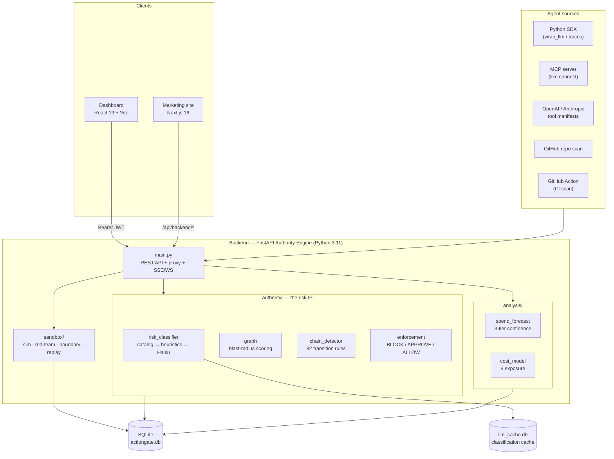

# Architecture

Arceo is a trust, cost, and control layer for AI agents. You point it at an agent —
via the SDK, an MCP server, an OpenAI/Anthropic tool manifest, or a GitHub repo —
and it produces a CFO-readable report: a monthly spend forecast with a confidence
band, the agent's blast radius, the dangerous action chains it can perform, and the
worst-case dollar exposure if one fires. It can also enforce policies at runtime.

## System overview

## Components

| Component | Path | Responsibility |
|---|---|---|
| **Authority Engine** | `backend/` | FastAPI app; all API, proxy, ingestion, and enforcement. Serves the built SPA in production. |
| **Risk engine** | `backend/authority/` | The IP: risk classification, blast-radius scoring, dangerous-chain detection, policy enforcement. |
| **Forecasting** | `backend/analysis/` | 3-tier spend forecast and per-tool dollar-exposure model. |
| **Sandbox** | `backend/sandbox/` | LLM simulation against 12 mock services, plus boundary / red-team / regression / replay testing. |
| **Dashboard** | `frontend/` | React 19 + Vite product UI. The Cost Portfolio (`/spend`) is the CFO-facing surface. |
| **Website** | `website/` | Next.js marketing site; proxies `/api/backend/*` to the backend. |
| **SDK** | `sdk/` | Installable Python package (`arceo`) for instrumenting deployed agents. |
| **GitHub Action** | `.github/actions/scan/` | Scores agent code on every push/PR via `POST /api/scan`. |

## Core concepts

- **10 universal risk labels** — `moves_money`, `touches_pii`, `deletes_data`,
  `sends_external`, `changes_production`, `changes_access`, `reads_secrets`,
  `evades_detection`, `bulk_export`, `executes_code`. Everything downstream is
  computed from the labels an agent's actions carry, not from hardcoded tool names.
- **Blast-radius scoring** (`authority/graph.py`) — per-action labels weighted by
  reversibility and read-vs-write, summed with diminishing returns and a density
  bonus, normalized and capped at 100.
- **Chain detection** (`authority/chain_detector.py`) — 32 risk-label transition
  rules (e.g. *reads PII → sends external* = exfiltration). Runs statically over
  capabilities and dynamically over execution traces, including cross-agent in
  multi-agent sims.
- **3-layer risk classification** — hardcoded catalog → keyword heuristics →
  Claude Haiku for unknowns, cached in-memory and persisted to `llm_cache.db`.
- **3-tier spend forecast** — capability-only → sandbox (±28%) → live from captured
  calls (±15%). Emits an explicit "no signal" state rather than a fake number.

## Request flow: runtime enforcement

1. An agent (or the enforcing proxy) calls `POST /api/enforce` with the tool,
   action, params, and session context.
2. `enforcement.py` matches policies by priority (BLOCK 100 > REQUIRE_APPROVAL 50 >
   ALLOW 10) and evaluates conditions (param comparisons, `requires_prior`).
3. The verdict is written to `execution_log`; a blocked action fires the configured
   Slack webhook and, if pending, lands in the approval queue.
4. The `/proxy/{service}/{path}` path wraps this transparently — enforce, then
   forward to the upstream API with the vaulted credential injected.

## Data & tenancy

- **Store:** a single SQLite file (`backend/actiongate.db`, or `ARCEO_DB_PATH`),
  raw `sqlite3`, no ORM, foreign keys on. Schema is defined in `db.py:init_db()`.
  17 application tables plus a separate `llm_cache.db`. A PostgreSQL migration path
  exists (`scripts/migrate_sqlite_to_pg.py`, `docs/MIGRATION_RUNBOOK.md`).
- **Multi-tenancy:** every row is scoped by `org_id`, taken from the JWT. All SQL is
  parameterized. Auth is JWT (24h) + bcrypt.
- **Security posture:** tamper-evident append-only audit log, envelope encryption at
  rest, and a credential vault for upstream secrets — see
  [`docs/SECURITY_DESIGN.md`](docs/SECURITY_DESIGN.md).

## Deployment

Single container (multi-stage `Dockerfile`): Node builds the SPA into
`backend/static/`, then `python:3.11-slim` runs uvicorn on `:8000` as a non-root
user and serves both the API and the SPA. Designed to run inside a customer VPC.
Health check: `GET /api/health`.

**Two backing services are required, and neither is optional:**

- **Postgres** (`DATABASE_URL`) — owns all schema via Alembic. The app refuses to
  boot without it unless `ARCEO_ENV` names a dev environment.
- **Redis** (`REDIS_URL`) — rate limiting, live-trace fan-out across workers, and
  the scheduler's leader lock. There is deliberately **no in-memory fallback**;
  one would silently reintroduce the multi-worker bugs it replaced. Rate limiting
  fails **closed**, so an unreachable Redis 429s login, `/api/enforce`,
  `/api/scan`, the LLM proxy and live-trace ingest while `/api/health` keeps
  answering 200. The app refuses to boot without it outside dev, because
  "up but rejecting everything" is a worse state than "not up".

⚠️ On Google Cloud that means Cloud SQL and **Memorystore plus a Serverless VPC
connector** — a prerequisite of the deployment, not an add-on to it.

Migrations run on startup only when `ARCEO_RUN_MIGRATIONS_ON_BOOT` is on
(default: dev only). In production the app runs as the restricted `arceo_app`
role while migrations need the owner role, so they are a deploy step; the app
still refuses to serve a schema that is behind the code. See
`docs/MIGRATION_RUNBOOK.md`.

## Known limitations

`main.py` is a ~5.5k-line monolith slated to split into domain routers; SQLite is
single-writer and blocks horizontal scale (PostgreSQL is the planned path); several
ingestion endpoints are intentionally unauthenticated. The full list lives in
[`CLAUDE.md`](CLAUDE.md) under "Known limitations & technical debt."
